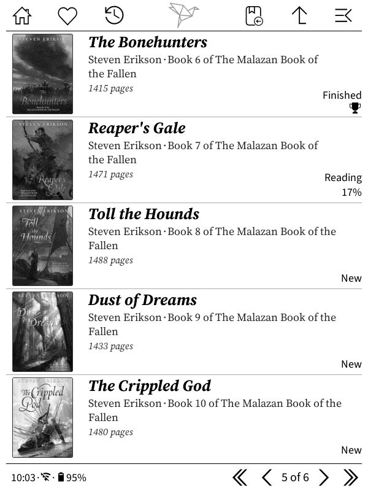

# Modular Tags Patch - Usage Guide
 

## What This Does

This patch **hijacks** the "Show calibre tags/keywords" field to display **anything you want** instead. Just change one setting and restart!

## Quick Start

### 1. Install the Patch

1. Save `2-modular-tags.lua` to: `koreader/patches/`
2. Restart KOReader

### 2. Enable the Field

1. Go to File Browser
2. Open menu → **Project: Title settings → Advanced settings → Book display**
3. Enable **"Show calibre tags/keywords"**
4. Return to file browser

### 3. Choose What to Display

Edit the `DISPLAY_MODE` setting at the top of the patch file:

```lua
local DISPLAY_MODE = "pages"  -- Change this!
```

**Available modes:**
- `"pages"` - Show page count (e.g., "350 pages")
- `"tags"` - Show original calibre tags (default behavior)
- `"pages_and_tags"` - Show both (e.g., "350 pages • Fiction • Sci-Fi")
- `"custom"` - Use the custom function (see below)

### 4. Restart KOReader

After changing the mode, restart KOReader to apply changes.

## Examples

### Example 1: Show Page Count

```lua
local DISPLAY_MODE = "pages"
```

Result: `350 pages` appears below author/series

### Example 2: Show Pages AND Tags

```lua
local DISPLAY_MODE = "pages_and_tags"
```

Result: `350 pages • Fiction • Science Fiction • Hugo Award Winner`

## Customization

### Font Size

You can adjust how the text looks:

```lua
-- Make text bigger (less offset from author font size)
local CUSTOM_FONT_SIZE_OFFSET = 1

-- Make text smaller (more offset from author font size)  
local CUSTOM_FONT_SIZE_OFFSET = 5

-- Set minimum font size
local CUSTOM_FONT_MIN = 12
```

### Custom Display Function

For complete control, use `DISPLAY_MODE = "custom"` and edit the `customFormat` function:

```lua
local DISPLAY_MODE = "custom"

local function customFormat(bookinfo, tags_limit)
    local parts = {}
    
    -- Show page count
    if bookinfo.pages and bookinfo.pages > 0 then
        table.insert(parts, tostring(bookinfo.pages) .. " pages")
    end
    
    -- Show series position (already shown elsewhere, but as example)
    if bookinfo.series_index then
        table.insert(parts, "#" .. bookinfo.series_index)
    end
    
    if #parts > 0 then
        return table.concat(parts, " | ")
    end
    
    return nil
end
```

**Available bookinfo fields:**
- `bookinfo.pages` - Number of pages
- `bookinfo.title` - Book title
- `bookinfo.authors` - Author(s) 
- `bookinfo.series` - Series name
- `bookinfo.series_index` - Series position
- `bookinfo.keywords` - Original tags/keywords
- `bookinfo.description` - Book description

## Troubleshooting

### Nothing shows up

1. Check that "Show calibre tags/keywords" is **enabled** in settings
2. Verify the patch file is in `koreader/patches/` folder
3. Check KOReader log for `"Modular Tags Patch"` messages
4. Make sure you restarted KOReader after changes

### Wrong data shows

1. Verify `DISPLAY_MODE` is set correctly
2. Check that books actually have that metadata (not all books have publisher, etc.)
3. Try `DISPLAY_MODE = "pages_and_tags"` to see if any data shows

### Text is too small/large

Adjust the font settings:

```lua
-- Smaller offset = larger text
local CUSTOM_FONT_SIZE_OFFSET = 1

-- Larger offset = smaller text
local CUSTOM_FONT_SIZE_OFFSET = 5

-- Override minimum size
local CUSTOM_FONT_MIN = 12
```

## Advanced: Combining Multiple Fields

You can show multiple pieces of information by editing the format functions:

```lua
local DISPLAY_MODE = "custom"

local function customFormat(bookinfo, tags_limit)
    local parts = {}
    
    -- Always show pages if available
    if bookinfo.pages and bookinfo.pages > 0 then
        local p = tonumber(bookinfo.pages)
        table.insert(parts, p .. " pg")
    end
    
    -- Show first 3 original tags
    local original_formatTags = ptutil.formatTags
    local tags = original_formatTags(bookinfo.keywords, 3)
    if tags then
        table.insert(parts, tags)
    end
    
    return table.concat(parts, " | ")
end
```

Result: `350 pg | Fiction • Sci-Fi • Adventure`

## Uninstall

To remove the patch:
1. Delete or rename `koreader/patches/2-modular-tags.lua`
2. Restart KOReader
3. The tags field will return to normal behavior
